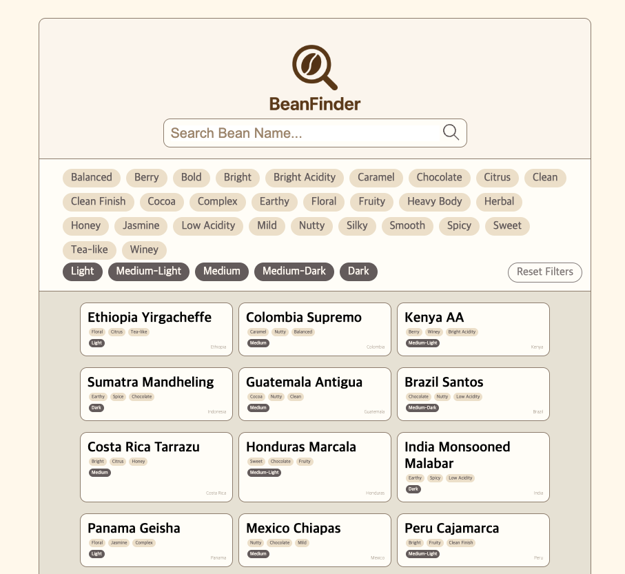

# React Project Template
```
bun create yoonseo23/react-template-yoon
```
## 과제 저장소 템플릿 구조
```
homework_react /
├── .vscode /
├── node_modules /
├── public /
├── src /
├── .gitignore
├── .prettierrc.json
├── bun-env.d.ts
├── bun.lock
├── bunfig.toml
├── eslint.config.mjs
├── index.html
├── package.json
├── tsconfig.json
├── vite.config.ts
└── README.md
```

**과제 구조**
- 작업 공간 : `homework_react / src`

```
src /
├── components_w2 /
│    ├── style /
│    │    ├── formContainer.css
│    │    ├── form.css
│    │    └── hidden-button.css
│    ├── form.jsx
│    ├── sign-up-form.jsx
│    ├── log-in-form.jsx
│    └── hidden-button.jsx
├── components_w3 /
│    ├── main-page.jsx // 메인 페이지
│    ├── logo.jsx // 추출한 컴포넌트 파일
│    ├── search-bar.jsx // 추출한 컴포넌트 파일
│    ├── filter-list.jsx // 추출한 컴포넌트 파일
│    ├── card-list.jsx // 추출한 컴포넌트 파일
│    ├── tag.jsx // 추출한 컴포넌트 파일
│    ├── card-flavor-tag.jsx // 추출한 컴포넌트 파일
│    ├── beans.json // dummy data
│    ├── datas.json // dummy data
│    ├── index.js // barrel file
│    └── main-page.css
├── image / // 이미지 및 아이콘 에셋 관리
│    ├── hidden.svg
│    ├── visible.svg
│    ├── bean-logo.svg
│    └── search-button.svg
├── styles /
│    ├── common / 기본 스타일 리셋, 접근성 및 사용자 정의 속성 관리
│    └── app.css // app.jsx 스타일링
├── app.jsx // 루트에 넣을 마크업 틀(개발용)
└── main.jsx // DOM에 업로드용 루트 생성

```

### 2주차 과제 회고
**상태가 있는 컴포넌트 만들기 - 회원가입/로그인 컴포넌트 제작**
- `form.jsx`
  - 상태('signup' | 'login')에 따라 각각의 폼을 로드하도록 구성
  - 회원가입 폼에서 넘긴 정보들(이름, 이메일, 비밀번호)를 바탕으로 로그인 폼에서 활용
- `hidden-button.jsx`
  - input의 type 속성을 text <-> password로 전환하여 비밀번호 보기/숨기기 버튼 구현
  - hidden 상태 관리를 통해 버튼 컨트롤
- `sign-up-form.jsx`, `log-in-form.jsx`
  - form 마크업을 작성해 반환
  - className을 공통적으로 작성하여 스타일링 시 일관성을 유지할 수 있도록 함.
  - useId, useRef, useState의 리액트 훅을 사용
    - useId : input, label을 묶어주는 id를 생성하기 위해 꼬리표(e.g. -name)를 붙임
    - useRef : DOM 요소에 직접 접근해 값을 받거나 저장하기 위해 사용
    - useState : 사용자에게 입력받는 값을 상태로 관리해 입력값을 컨트롤함.
  - 비밀번호 확인 로직 구현 : form의 submit event 발생 시, 사용자의 입력값이 '패스워드'와 '패스워드 확인'에서 일치하는지 확인하도록 함.
  - 로그인 폼에 회원가입 시 입력한 정보가 넘어가도록 구성(서버로 넘어가지 않고, 프론트 단에서 처리할 수 있도록 상태를 공유하는 방식으로 구현함)
    - 회원가입 폼에서 입력한 이메일 주소는 로그인 폼에서도 남아있도록, 비밀번호는 로그인 폼 제출 시 회원가입 폼에 입력한 값과 일치하는지 확인하는 용도로 상태 부여.
  - placeholder에 있는 조건을 minLength, pattern을 활용해 조건을 만족하는 입력값을 받을 수 있도록 구성.
- `form.css`
  - css 선언 순서나 선언 방식에 일관성을 최대한 유지하여 작성
  - flexbox를 활용해 레이아웃을 구성함
  - submit button의 경우, position: absolute를 부여해 위치를 설정하고, inset-inline: 0을 부여해 너비 변화에 유연하게 반응할 수 있도록 구현함.
  - min-inline-size를 부여해 화면 너비가 줄어들었을 때에도 화면 구성이 깨지지 않도록 구현함.
  - tab접근을 통해 submit button에 포커스가 이동했을 때, 파란 색상의 아웃라인이 눈에 잘 띄지 않는 점을 확인하여, 사용자 경험 향상을 위해 outline-offset을 별도로 부여함.

**느낀 점**
첫 리액트 컴포넌트 제작... 진짜 어려웠다.
이번 주에 이렇게 바쁠 줄 몰랐던 3개월 전의 내가 이 (리액트만 파도 모자를) 연휴에 가족여행을 잡았다...
덕분에 신나게 놀고 집중해서 과제를 할 수 있던 걸지도...

그래도 리액트를 배워서 마크업을 구성하고, 스타일링을 하다보니 확실히 편한...지는 아직 모르겠지만 신기하기도 하고 재밌기도 하다.
또 이렇게 SPA 구조의 웹사이트를 직접 구성하고 구현해보는게 처음인데, 그만큼 이번 과제를 하면서 단기간에 뭔가 많은 꺠달음을 얻은 기분이 든달까?

그리고 또 하나 느끼는 건, 이젠 UI 구현은 당연하게 하다 보니까 점점 UI 디버깅 실력은 느는 기분이 든다(기분 탓일 수도 있지만...ㅎ). 이제 원하는 레이아웃을 구성하는 것까진 할 수 있게 되었다는데서 의미를 찾아야 할까? 아직 사용자 경험이나 접근성 고려, 성능 최적화 등등 파고들어야 할 부분은 정말 많지만, 바로 앞의 하나하나부터 차근차근 얻어가려고 한다.

이번 과제에서 해결하지 못한 것 중 하나가, '암묵적 any type'을 계속 eslint에서 경고했는데, 아직 해결하지 못했다. 타입스크립트 공부를 부지런히 끝내고 추후 이 문제도 해결해봐야겠다.

그리고 배포 공부를 다시 해야겠다...
과제를 배포해서 제출하려고 배포만 한참 들여다봤는데도 배포화면에서는 작업물이 안 보인다...
이렇게 하나씩 뭘 모르는지 뭐가 부족한지 배워가는 거겠지..? 갈 길이 멀다ㅠ

### 3주차 과제 회고
**카드 검색 리스트 UI**

[과제 디자인 시안](https://www.figma.com/design/doxYVZwp8SU0tdmAl5KU73/BeanFinder?node-id=0-1&p=f&m=dev)


- `main-page.jsx`
  - 상태를 관리하는 React Hook(useState) 사용
  - 컴포넌트를 한 번에 불러오도록 하여 import 경로 단순화
  - 검색어 입력값, 선택된 필터링 상태값을 관리
  - 검색에 따른 결과, 풍미/로스팅 종류에 의한 필터링 결과를 모은 const 상수 작성
  - 필터 적용을 리셋하는 함수
  - 컴포넌트 조립
- `index.js`
  - barrel file
  - main-page에 쓰이는 컴포넌트 함수를 re-export
- `logo.jsx`
  - 별도의 기능을 가진 페이지 변경이 없어 로고는 이미지로 마크업함
    (일반적으로 쓰이는 홈으로 이동하는 등의 기능 구현 X).
- `search-bar.jsx`
  - 사용자 입력값을 상태로 관리
  - 컴포넌트 내부에서 고유한 id값 생성을 보장하는 React Hook(useId) 사용, form의 input과 label 연결
  - 상위 컴포넌트에서 onSearch 속성 받음. 검색어 상태를 변경하는 함수를 넘김.
  - 해당 속성을 form의 onSubmit이벤트에 연결된 handleSearch에 연결
  - 검색 시, 페이지가 리로드되지 않도록 하기 위해 submit에 대한 브라우저의 기본 작동을 방지하고, 검색 이벤트 수동적으로 구현
  - 사용자 입력값은 검색창에 실시간으로 반영될 수 있도록 구현 + 검색 결과 필터링은 form 제출 시 반영되도록 구현
- `filter-list.jsx`
  - flavorNote, roast에 대해 선택된 필터와 그 필터를 토글하는 함수, 리셋함수를 인자로 받음
  - selected값을 TagFlavors, TagRoast 각각에 연결해 두 필터는 동시에 선택될 수 있으나 각 필터 안에서는 동시에 한 가지 값만 선택될 수 있도록 함
- `card-list.jsx`
  - 조건에 맞는 원두가 없을 경우 안내 메시지 작성
  - 상위 컴포넌트로부터 필터링된 원두 배열을 받아 카드에 데이터 뿌리고 렌더링
- `tag.jsx`
  - TagFlavors, TagRoast의 경우 각각 다른 속성에 대해 같은 역할을 하는 함수이므로 같은 파일 내에서 각각 export
  - tagFlavors, tagRoast의 경우 필터 버튼이므로 중복값이 없도록 Set으로 설정
  - 선택/해제 상태에 대해 aria-pressed 속성을 사용해 현재 리스트아이템의 버튼이 선택되었는지를 인식
- `card-flavor-tag.jsx`
  - 같은 필터용도의 요소이나, 클릭가능한 버튼의 역할을 하지 않으므로 span으로 마크업
  - 리스트렌더링시의 key로 tag 자체를 넘김
- `beans.json`, `datas.json`
  - AI를 통해 원두 종류에 따른 특징들을 객체로 표현한 dummy data 구성
  - 필터링 용도로 쓰일 flavorNote, roast 속성의 경우 중복없이 구성한 새 객체 배열로 별도 작성

**이슈 및 해결**
처음에는 지금처럼 검색하는 결과들이 검색 폼 제출 시에 보여지는 것이 아니라, 실시간으로 입력값에 따라 필터링되는 로직으로 작성을 했었는데, 그렇게 구현을 하고보니 검색 버튼의 쓸모가 사라졌다. 모양 뿐인 요소가 필요없다고 생각하기도 했고, 그렇다고 검색을 하는데 검색 버튼이 없다는 건 사용자에게 찜찜한 경험을 줄 것 같아 submit 이벤트에 연결하는 방식으로 변경하였다.

**추후 개선 방향**
- typeahead 구현 : dummydata에 있는 이름들을 바탕으로 자동완성 기능을 구현하면 스펠링이 헷갈린다거나 할 때 사용자의 경험을 더 개선할 수 있을 것으로 예상된다.
- 카드 이미지 및 세부사항 모달 구현 : 실제로 원두 정보를 소개하는 페이지로 개선을 하게 된다면, 관련 이미지를 넣어 시각적 보완을 하고, 세부 정보를 제공하는 모달창을 카드클릭시 보여주면 더 많은 정보를 제공할 수 있을 것 같다. 또한 일반적인 웹사이트를 생각해볼 때, 이런 카드 리스트의 경우 클릭 가능한 경우가 많으므로, 해당 기능을 고려해볼 만하다.
- 선택된 필터값의 스타일링 개선 : 현재 로스팅 종류 필터 버튼이 선택되었을 시의 아웃라인이 눈에 잘 띄지 않는 이슈가 있다. 배경은 상당히 밝으나 전경색이 다소 어두워 중간색을 쓰더라도 아웃라인이 눈에 잘 들어오지 않는다는 것을 알게 되었다. 다른 레퍼런스들을 참고하여 이런 UI에서는 어떻게 선택된 결과를 표현할 수 있을지 고민해보면 좋을 듯하다. 

**느낀 점**
지난 Vanilla 프로젝트 진행 시에도 자유주제를 고르면서 팀원분이 직접 디자인 시안 제작에 나섰는데, Final 프로젝트 때를 대비해 이번엔 커스텀 디자인 시안을 바탕으로 UI를 구현해야겠다고 생각하게 되었다.

카드 검색 리스트를 구현해야 하므로, 사용자 정보처럼 특정 주제에 대해 종류별로 속성을 가지고 있을 만한 데이터를 구성할 필요가 있었는데, 마침 카페 알바 끝나고 퇴근하던 길이라... 원두 종류로 더미 데이터를 만들어 작업하였다.

2주차 과제 때보다 컴포넌트도 많아지고, 구현하는 로직 복잡성이 살짝 증가하여 처음에 어떻게 설계를 하면 좋을지 고민을 꽤 했다. 우선은 단일 파일 내에서, 작은 컴포넌트부터 하나씩 만들어가며 조립을 시작했다.

이번에 사용한 것과 같이, 선별적으로 아이템들을 걸러내는 필터 로직을 작성할 때 식을 작성하는 방식이나, 리스트렌더링 시에 반환 함수를 어떻게 작성해야하는지 아직 헷갈린다. 또한 코드를 안전하게 작성하기 위해 해야하는 고민이 무엇인지에 대한 사고 확장이 덜 된 것 같달까ㅠ

중고등학교 때, "모르는 것"은 끝까지 고민해봐야 내가 "모르는 것"이라고 생각해 효율성을 추구하기 위해 답지를 보는 것을 꺼리지 않고 더 많은 문제에 응용하여 필연적일 수밖에 없는 로직을 이해하고, 풀이 방식을 체화하려고 노력했던 생각이 난다.
지금의 코드 작성과정도 마찬가지라는 생각이 든다. 구현 방식을 모르겠거나, 구조가 헷갈리거나 하면 AI의 도움을 받아가며 진행을 하였는데, 처음에는 AI가 알려준 로직을 참고하는게 답지를 보는 기분이라 썩 유쾌하진 않았지만, 점점 그 방식 자체가 익숙해지는게 느껴지다보니, 후엔 내가 처음부터 끝까지 큰 막힘 없이 코드를 써내려갈 수 있지 않을까 하는 기대를 자연스레 하게 되는 것 같다.
